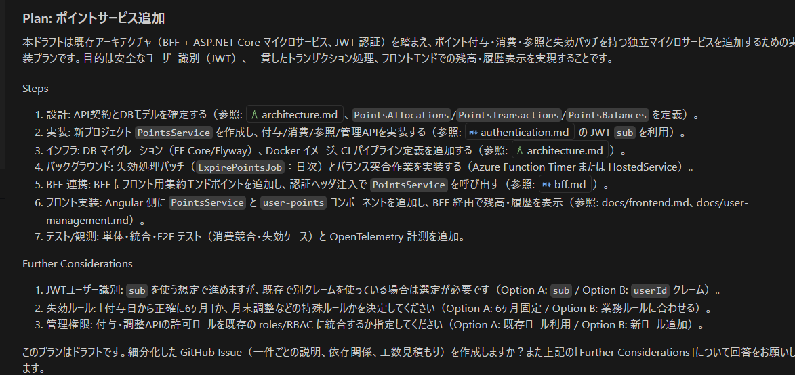

Planモードで実行
---
現在のサービスにポイントサービスを追加します。

ポイントは各サービスの利用により積算される仕組みです。
仕様は下記のとおりです。

- ポイントサービスはほかサービス同様のマイクロサービスで構成される
- ポイントサービスのポイントを付与、消費するためのサービスは各サービスで判断・実装されるため今回の機能追加では考慮しません
- ポイントサービスは下記の機能を有します
  - ポイントの付与、消費を利用者ごとに管理します
  - ポイントの付与、消費を行うためのWebAPIを提供し、各サービスから利用できるようにします
  - ユーザーごとのポイントの状態を参照するためのWebAPIを提供します
  - ポイントの失効は半年後に実施されます。失効後は失効ステータスとなります。削除されません。
- なりすまし防止のため、認証サービスで発行されたJWTトークン内に格納されているユーザー情報をベースに処理が実行されます
- フロントエンドではユーザー管理画面で自分が今所持しているポイントとポイントの履歴を確認することができます

以上の仕様と、現在格納されているアーキテクチャ情報をベースに実装プランを作成してください。
作成された実装プランをもとにGitHubのIssueを作成します。
Issueごとに開発者を割り当て、またはCoding Agentを割り当て作業を実施します。
作業の混乱が発生しにくいような粒度に分割し、かつ依存関係がある作業となる場合はそれを明記してください。
説明が不足している点があれば質問してください

---
一回目の返却  
  
にたいする返却

1. JWTでSubを使っていない想定として、Authサービスに変更を加える形でPlanを組んでみますか
2. 付与日から正確に6か月後(180日)でお願いします
3. 新ロールを追加する形で考えましょう

---
この情報をベースにGitHubのIssueを作成します。
Issueごとに開発者を割り当て、またはCoding Agentを割り当て作業を実施します。
作業の混乱が発生しにくいような粒度に分割し、かつ依存関係がある作業となる場合はそれを明記してください。

Issueはコピーして作成するので、`docs/feature/`内にIssueごとに分離して作成してください